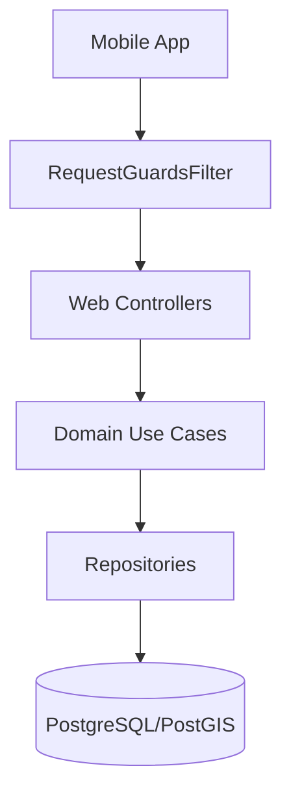

<h1 align="start">Meer API</h1>

<p align="start">
  <a href="https://medium.com/@eduardofelipi"></a>
  <a href="https://www.youtube.com/channel/UCYcwwX7nDU_U0FP-TsXMwVg"></a>
  <a href="https://github.com/edufelip"></a>
  <a href="https://www.linkedin.com/in/eduardo-felipe-dev/"></a>
  <a href="http://localhost:8080/swagger-ui/index.html"></a>
  <a href="http://localhost:8080/v3/api-docs"></a>
</p>

<p align="start">
  <strong>Meer API</strong> is the backend service for <strong>Meer</strong>, a mobile application dedicated to discovering and sharing thrift stores, vintage shops, and secondhand guide content. Built with Java 17 and Spring Boot.
</p>

## 🛠 Tech Stack
- **Language:** Java 17
- **Framework:** Spring Boot 3 (Web, Data JPA, Validation)
- **Database:** PostgreSQL (prod/dev) with optional PostGIS; H2 for local sandbox
- **Caching:** Caffeine in-process caching (featured, guides, ratings)
- **Security:** JWT, Firebase App Check, Custom Request Guards
- **Build:** Gradle wrapper

## 🚀 Quick Start

Get up and running in a few minutes.

### Prerequisites
- **Java 17+** (Set `JAVA_HOME`)
- **PostgreSQL 14+** (Optional for local-db profile, H2 is used by default for local sandbox)
- **Gradle 8+** (Wrapper included)

### Steps

1. **Clone the repository**
   ```bash
   git clone <your-repository-url>
   cd meer-api/springboot
   ```

2. **Configure Environment**
   Copy the example environment file.
   ```bash
   cp .env.example .env
   ```
   *Edit `.env` to set your database credentials if using the `local-db` profile.*

3. **Run the Application**
   ```bash
   # Mac/Linux - Runs with default settings
   ./run-local.sh
   ```
   The API will be available at `http://localhost:8080`.

   *Alternative using Gradle directly:*
   ```bash
   # Run with in-memory H2 database (no setup required)
   SPRING_PROFILES_ACTIVE=local ./gradlew bootRun
   ```

## ⚙️ Configuration

The application relies on environment variables defined in `springboot/.env`.

| Variable | Description |
| :--- | :--- |
| `DB_HOST`, `DB_PORT` | PostgreSQL connection details. |
| `SECURITY_REQUIRE_APP_HEADER` | If `true`, requires `X-App-Package` header on protected routes. |
| `SECURITY_REQUIRE_APP_CHECK` | If `true`, enforces Firebase App Check token validation. |
| `SECURITY_JWT_SECRET` | Secret key for signing JWTs (Min 32 bytes). |
| `GOOGLE_*_CLIENT_ID` | OAuth client IDs for Google Sign-In. |
| `MEER_CORS_ALLOWED_ORIGINS` | Comma-separated list of allowed origins for CORS (set your Vercel domains). |
| `MEER_POSTGIS_ENABLED` | Enable PostGIS geography KNN queries for /nearby. |

*See `.env.example` for the full list.*

## 🏗 Architecture

The application follows a clean layered architecture.



### Code Map (Key Paths)
- **Controllers:** `web/` — HTTP handling.
- **Business Logic:** `domain/` — Use cases and rules.
- **Data Access:** `domain/repo/` — Spring Data JPA repositories.
- **Entities:** `core/` — Domain entities.
- **Security:** `security/` — JWT provider and request guards.

## 🔌 Core Endpoints

<details>
<summary><b>🛍️ Stores & Photos (GCS direct upload)</b></summary>

| Method | Path | Description |
| :--- | :--- | :--- |
| `POST` | `/stores` | Create store metadata (JSON only, no photos). |
| `POST` | `/stores/{id}/photos/uploads` | Get presigned upload slots (GCS) for images. |
| `POST` | `/stores/{id}/photos` | Confirm photos with `fileKey` + `position`; supports `deletePhotoIds` for removals. |
| `PUT` | `/stores/{id}` | Update store metadata (phone, categories lowercased, etc.). |
| `DELETE` | `/stores/{id}` | Deletes store and its GCS objects (allowed for owner or ADMIN). |
| `GET` | `/nearby` | Find stores near lat/lng; uses PostGIS when enabled. |
| `GET` | `/featured` | Top 10 featured stores (cached). |
| `GET` | `/home` | Aggregated feed (featured, nearby, top guides). |

</details>

<details>
<summary><b>📰 Guide Content</b></summary>

| Method | Path | Description |
| :--- | :--- | :--- |
| `POST` | `/contents` | Create content (title, description, storeId). |
| `POST` | `/contents/{id}/image/upload` | Get a single presigned slot for the cover image. |
| `PUT` | `/contents/{id}` | Update description/title/imageUrl. |
| `GET` | `/contents/top` | Paged, store-scoped list; items include `thriftStoreId`, `thriftStoreName`, `createdAt`. |
| `DELETE` | `/contents/{id}` | Delete content. |

</details>

<details>
<summary><b>🛡 Admin Dashboard (role = ADMIN)</b></summary>

| Method | Path | Description |
| :--- | :--- | :--- |
| `GET` | `/dashboard/stores` | Paged stores list (search `q`, sort `newest|oldest`). |
| `GET` | `/dashboard/contents` | Paged contents list (search `q`, sort `newest|oldest`). |
| `GET` | `/dashboard/users` | Paged users list (search `q`, sort `newest|oldest`). |
| `GET` | `/dashboard/support/contacts` | Paged support contact messages. |
| `GET` | `/dashboard/support/contacts/{id}` | Support contact detail. |
| `DELETE` | `/dashboard/support/contacts/{id}` | Delete support contact. |
| `DELETE` | `/dashboard/contents/{id}` | Delete guide content. |
| `DELETE` | `/dashboard/users/{id}` | Delete user. |

All require bearer JWT with `role=ADMIN` (claim and DB value).
New admin endpoints should always be placed under `/dashboard/**` so they are covered by the dashboard admin guard.
Pagination in admin APIs is 0-based: send `page=0` for the first page; responses echo the same 0-based page number.

</details>

<details>
<summary><b>🔐 Authentication</b></summary>

| Method | Path | Description |
| :--- | :--- | :--- |
| `POST` | `/auth/login` | Email/Password login. |
| `POST` | `/auth/signup` | Register new user. |
| `POST` | `/auth/google` | Google OAuth login. |
| `POST` | `/auth/apple` | Apple Sign-In. |

</details>

*Full API documentation available via Swagger UI at `http://localhost:8080/swagger-ui/index.html`.*

## 🛡 Security Model

- **Public Routes:** Auth endpoints (`/auth/*`).
- **Protected Routes:** All others pass through `RequestGuardsFilter`.
  - **App Check:** Verified if `SECURITY_REQUIRE_APP_CHECK=true`.
  - **App Header:** `X-App-Package` checked if `SECURITY_REQUIRE_APP_HEADER=true`.
  - **JWT:** Bearer token required unless `SECURITY_DISABLE_AUTH=true`.

## ⚡ Performance & Data

- **Spatial Queries:** PostGIS `geography` KNN queries are preferred for "nearby" searches. The app falls back gracefully to Haversine formulas if PostGIS is absent.
- **Caching:** Caffeine (in-memory) is used for high-traffic read endpoints:
    - `featuredTop10` (10m TTL)
    - `guideTop10` (10m TTL)
    - `storeRatings` (5m TTL)
- **Images:** Uploads are resized to ≤1600px and compressed to JPEG/WebP to ensure fast mobile loading.

## ❓ Troubleshooting

**Issue: `function geography(geometry) does not exist`**
- **Cause:** PostGIS extension is missing in your Postgres instance.
- **Fix:** Install PostGIS packages, run `CREATE EXTENSION IF NOT EXISTS postgis;` and optionally `CREATE INDEX thrift_store_geog_idx ON thrift_store USING GIST (geography(ST_SetSRID(ST_MakePoint(longitude, latitude), 4326)));` then start the app with `MEER_POSTGIS_ENABLED=true`.

**Issue: 403 Forbidden on Localhost**
- **Cause:** Missing Auth token or App Headers.
- **Fix:** Ensure you are sending `Authorization: Bearer <token>` and `X-App-Package` (if enabled). Or set `SECURITY_DISABLE_AUTH=true` in `.env` for testing.

## 🤝 Contributing

1. Create a feature branch.
2. Run tests: `./gradlew :springboot:test`
3. Commit changes following conventional commits (`type(scope): summary`).
4. Open a PR.

## 📄 License

This project is licensed under the [MIT License](LICENSE).
