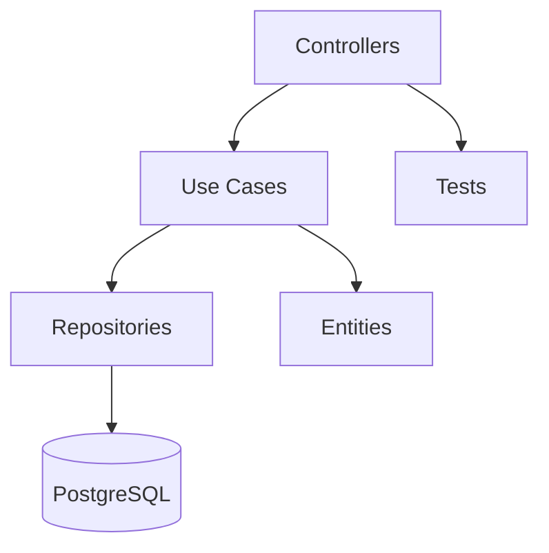

<h1 align="start">Meer API</h1>

<p align="start">
  <a href="https://medium.com/@eduardofelipi"></a>
  <a href="https://www.youtube.com/channel/UCYcwwX7nDU_U0FP-TsXMwVg"></a>
  <a href="https://github.com/edufelip"></a>
  <a href="https://www.linkedin.com/in/eduardo-felipe-dev/"></a>
  <a href="http://localhost:8080/swagger-ui/index.html"></a>
  <a href="http://localhost:8080/v3/api-docs"></a>
</p>

<p align="start">
  This repository hosts the RESTful Spring Boot API that powers the Meer application.
</p>

## Prerequisites

- Java 24+ (set via `JAVA_HOME`).
- Gradle 8+ (or use the bundled `./gradlew`).

## Clone

```
$ git clone <your-repository-url>
```

## Spring Boot API (Kotlin)
Location: `springboot/`

- Environment
  - DB vars: `DB_HOST`, `DB_PORT`, `DB_NAME`, `DEVDB_NAME`, `DB_USER`, `DB_PASSWORD` (a `.env.example` is provided under `springboot/`; copy to `.env` and fill in—do not commit secrets).
  - Defaults: if no env is set, the app boots with in-memory H2 under profile `local`; Postgres URLs are built from the DB vars for other profiles. Security toggles: `SECURITY_REQUIRE_APP_HEADER`, `SECURITY_REQUIRE_APP_CHECK`, `SECURITY_DISABLE_AUTH`.
  - Profiles: `default` (cloud/dev), `local-db` (local Postgres), `prod` (production), `local` (H2 sandbox). Set via `SPRING_PROFILES_ACTIVE`.
- Run
  - `cd springboot && ./run-local.sh` — loads `.env` if present; starts API with `SPRING_PROFILES_ACTIVE` defaulting to `prod` (remote Postgres).
  - `SPRING_PROFILES_ACTIVE=local-db ./gradlew bootRun` — run against local Postgres.
  - `SPRING_PROFILES_ACTIVE=local ./gradlew bootRun` — in-memory H2 sandbox.
  - `SPRING_PROFILES_ACTIVE=prod ./gradlew bootRun` — production settings (provide prod DB vars).
  - `cd springboot && ./run-tests.sh` — loads `.env` and runs tests (default profile `local-db`).
  - `./gradlew clean build` — compiles, runs checks, and packages the jar.
- Docs: Swagger UI at `/swagger-ui/index.html` and raw OpenAPI at `/v3/api-docs` once the app is up.
- Security model (configurable via env):
  - App header guard: `X-App-Package` must equal `security.appPackage` (default `com.edufelip.meer`) when `SECURITY_REQUIRE_APP_HEADER=true`.
  - Firebase App Check header: `X-Firebase-AppCheck` required when `SECURITY_REQUIRE_APP_CHECK=true` and `SECURITY_DISABLE_AUTH=false`.
  - Firebase Auth: `Authorization: Bearer <idToken>` required unless `SECURITY_DISABLE_AUTH=true` (verification stubbed; plug in Firebase Admin when credentials are set).
  - Flags: `SECURITY_REQUIRE_APP_HEADER`, `SECURITY_REQUIRE_APP_CHECK`, `SECURITY_DISABLE_AUTH` (all wired in `springboot/src/main/resources/application.yml`).
  - API auth: `/auth/signup` (name, email, password), `/auth/login` (email, password), `/auth/google` (provider,idToken,client) return JWT `token` + `refreshToken` and user info; `/auth/me` validates access tokens; `/auth/refresh` takes `refreshToken` and returns a new access token (and rotated refresh). Invalid/expired tokens return 401 with `{ "message": "Invalid or expired token" }`; invalid refresh tokens return 401 with `{ "message": "Invalid refresh token" }`. Set `GOOGLE_ANDROID_CLIENT_ID`, `GOOGLE_IOS_CLIENT_ID`, and `GOOGLE_WEB_CLIENT_ID` for Google login audience validation.

## Uploads
- Multipart endpoints (placeholder implementations) accept `.png` up to ~300KB (wire storage as needed):
  - `POST /uploads/communities` with parts `community` (JSON) + `community` (file)
  - `POST /uploads/posts` with parts `post` (JSON) + optional `post` (file)
- Files should be persisted under a storage dir (`public/` or configured bucket) once storage is wired.

## Architecture Overview
- Controllers: `springboot/src/main/kotlin/com/edufelip/meer/web/` only map HTTP requests and delegate to use cases.
- Use Cases: `springboot/src/main/kotlin/com/edufelip/meer/domain/UseCases.kt` encapsulate business logic.
- Repositories/Entities: Spring Data interfaces in `springboot/src/main/kotlin/com/edufelip/meer/domain/Repositories.kt`; entities live per context under `springboot/src/main/kotlin/com/edufelip/meer/core/**`.
- DTOs & Mappers: DTOs in `springboot/src/main/kotlin/com/edufelip/meer/dto/` with mapping helpers in `springboot/src/main/kotlin/com/edufelip/meer/mapper/`.
- Tests: single entry point at `springboot/src/test/kotlin/com/edufelip/meer/MeerApplicationTests.kt` covering application-level invariants.
- Configuration: `springboot/src/main/resources/application.yml` keeps datasource, profiles, and security flags together.

## Architecture Diagram


## Code Map (Key Paths)
- `springboot/src/main/kotlin/com/edufelip/meer/web/` — REST controllers handling routes.
- `springboot/src/main/kotlin/com/edufelip/meer/domain/UseCases.kt` — domain behaviors.
- `springboot/src/main/kotlin/com/edufelip/meer/domain/Repositories.kt` — Spring Data contracts.
- Entities split by context: `springboot/src/main/kotlin/com/edufelip/meer/core/auth/AuthUser.kt`, `springboot/src/main/kotlin/com/edufelip/meer/core/category/Category.kt`, `springboot/src/main/kotlin/com/edufelip/meer/core/content/GuideContent.kt`, `springboot/src/main/kotlin/com/edufelip/meer/core/store/ThriftStore.kt` (shared ids in `springboot/src/main/kotlin/com/edufelip/meer/core/Ids.kt`).
- DTOs: `springboot/src/main/kotlin/com/edufelip/meer/dto/`; mappers in `springboot/src/main/kotlin/com/edufelip/meer/mapper/`.
- `springboot/src/main/resources/application.yml` — runtime configuration.
- `springboot/src/test/kotlin/com/edufelip/meer/MeerApplicationTests.kt` — integration-style smoke tests.

## Maintainers
This project is maintained by:
* [Eduardo Felipe](http://github.com/edufelip)

## Contributing

1. Fork it
2. Create a feature branch (`git checkout -b my-new-feature`)
3. Run `./gradlew test` and `./gradlew clean build`
4. Commit with a descriptive message
5. Push the branch and open a pull request with summary, tests run, and linked issues
